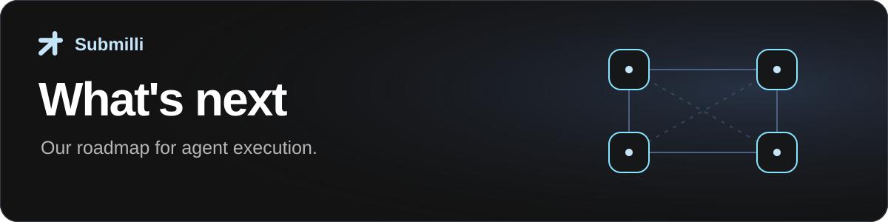

# Roadmap

We want agents to carry out longer tasks, recover when things go wrong, and bring people in when a decision needs them. These are four areas we plan to build in Submilli.

| [Durability](#durability) | [Undo](#undo) | [Ask human](#ask-human) | [Managed cloud](#managed-cloud) |
| :--- | :--- | :--- | :--- |
| Resume interrupted work | Reverse supported actions | Pause for a person | Run without managing servers |

> [!NOTE]
> **Planned direction, no fixed dates.** Scope and order may change. The examples below describe intended behavior. See the [documentation](https://submilli.ai/docs/) and [release notes](https://github.com/submilli/submilli-runtime/releases) for what is available today.

---

## Durability

**Resume a program after an interruption without starting its work again.**

We want execution state and completed results to survive a restart, so a long task can continue from where it stopped.

**Example:** An agent's code fails with an error partway through a task. The agent fixes the code and continues execution from the point of failure, preserving completed work instead of starting over.

External effects need explicit recovery rules: when a service's response is lost, the runtime must distinguish a completed action from one whose outcome is unknown.

---

## Undo

**Reverse an agent’s actions where the underlying system supports it.**

We want [Packages](https://submilli.ai/docs/packages) to describe how an operation can be undone, and let people inspect what a rollback would change before running it.

**Example:** An agent that changes a set of records could restore their previous values where it is safe to do so. Undo must account for changes made since the original action and make partial failures visible. Some effects, such as a delivered email, cannot be reversed; those limits should be clear before execution.

---

## Ask human

**Pause for approval or missing information, then continue with the response.**

We want this to work within the runtime's permission system, with a record of what was requested and what the person decided.

**Example:** A [Blueprint](https://submilli.ai/docs/blueprints) could allow small refunds automatically and require approval for larger ones. Approval should apply to the specific requested action, and a refusal should leave that action unexecuted. The existing `ask-human` policy action denies execution today; the approval and resume flow is planned.

---

## Managed cloud

**Run Submilli without operating the servers yourself.**

We plan a hosted service alongside the open source runtime, with a free tier and managed operation, scaling, and support.

The goal is to take the Blueprints and Packages you use locally into a hosted environment, while keeping permissions and resource limits under your control.

---

## Help shape the work

Tell us which of these would help you ship, and what you need it to do. Share a use case in a [GitHub issue](https://github.com/submilli/submilli-runtime/issues) or join us on [Discord](https://discord.gg/VphpukeGGj).
